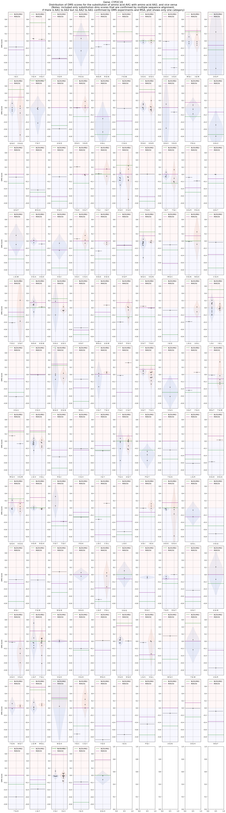

# DMS-MSA data analyser
Example analysis for 1 gene (CYP2C19) is present in [section 'CYP2C19'](#cyp2c19). The same analysis I will apply for aggregated DMS data from [zenodo](https://zenodo.org/records/11201737):

## CYP2C19:

- DMS scores pulled from [MaveDB](https://www.mavedb.org/score-sets/urn:mavedb:00001199-a-1)
- Multiple Alignment pulled from [Ensembl](https://www.ensembl.org/Homo_sapiens/Gene/Compara_Ortholog?db=core;g=ENSG00000165841;r=10:94762681-94855547)

### Results: CYP2C19 dms scores vs. substitution scores
#### Transition from amino acid X to amino acid Y and vice versa
CYP2C19 DMS scores produced by the VAMP-Seq method ([Matreyek et al. 2018](https://www.nature.com/articles/s41588-018-0122-z)). These have the median null mutation at 0, neutral variants at 1 and positive variants (i.e., improved function) greater than 1.

We normalized CYP2C19 DMS scores with minmax scaling around neutral point, so that:
- -1<=x<0: Indicate reduced function relative to WT
- 0<x<=1: Indicate improved function relative to WT
- x=0: neutral or WT

#### Transition from amino acid X to amino acid Y with BLOSUM62, PAM250
Additionally, we compared scores with substitution scores BLOSUM62 and PAM250. There are also other substitution scores available in [BioPython](https://github.com/biopython/biopython/tree/master/Bio/Align/substitution_matrices/data). 
- BLOSUM62 has been chosen because it showed one of the best correlations with CYP2C19 DMS scores (pearson correlation 0.407), along with 
- BENNER74 substitution scores (pearson correlation 0.411), 
- BLASTP (pearson 0.407), 
- BLOSUM50 (pearson 0.411),
- BLOSUM80 (pearson 0.415),
- BLOSUM90 (pearson 0.428),
- GONNET1992 (pearson 0.412),
- RAO (pearson 0.427)

See [DMS and substitution scores correlations](####dms-and-substitution-scores-correlations)

To compare substitution scores (BLOSUM62 and PAM250) we normalized them to the same scale as DMS scores using minmax around neutral point:
- -1<=x<0: Indicate unfavorable substitutions relative to the observed range.
- 0<x<=1: Indicate favorable substitutions relative to the observed range.
- x=0: Represent neutral to moderately favorable/unfavorable substitutions, depending on the distribution of original scores.
  
Shifted score: (X - neutral(near WT) score)

Normalized X:

\begin{cases} 
\frac{X_{\text{shifted}}}{X_{\text{shifted\_max}}} & \text{if } X_{\text{shifted}} > 0 \\
\frac{X_{\text{shifted}}}{|X_{\text{shifted\_min}}|} & \text{if } X_{\text{shifted}} < 0 \\
0 & \text{if } X_{\text{shifted}} = 0
\end{cases}

Where:
- \( X_{\text{shifted}} = X - \text{Neutral Point} \)
- \( X_{\text{shifted\_max}} \) is the maximum of the shifted scores.
- \( X_{\text{shifted\_min}} \) is the minimum of the shifted scores.
- The neutral point (0 after shifting) is mapped to 0 in the normalized set.

#### DMS and substitution scores correlations
 mutations with edit distance (number of nucleotides in codon ancestral aa is away from variant aa) >1 are filtered out from the plot because it's evolutionary unlikely
 
 
 
 
 
 
 
 
 

### Results: CYP2C19 dms scores vs. conservation scores
#### Correlations
We performed analysis to find patterns between DMS scores and conservation scores. For this analysis we aligned CYP2C19 sequence from MaveDB with multiple sequence alignment pulled from Ensembl.
We calculated several conservation scores from this MSA:
- [Shannon Entropy](https://en.wikipedia.org/wiki/Entropy_(information_theory))
- Percentage (proportion) Identity calculated as variant_residue_count / total_unique_species_count
- [PhastCons]( https://github.com/CshlSiepelLab/phast)

As for correlations between dms and substitution we considered only mutations with edit distance of 1 nucleotide.
We compared dms scores with Shannon entropy and calculated correlations between DMS scores and
- DMS vs. Shannon
- DMS vs. Percentage Identity
- Percentage Identity vs. Shannon (they are highly correlated which is expected)

#### Per position DMS vs. variant residue proportion

we took all AA1->AA2 (where AA2 != AA1 and AA2 != gap) transitions which are confirmed by MSA and DMS and plottted all possible variants aiming to find correlation between variant proportion and dms score. For CYP2C19 it is hard to say if the correlation exist because data is sparse. 

